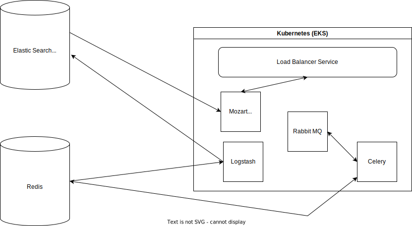

# unity-sps-prototype

This repository is the prototype deployment for the Unity SPS pipeline.

For details please check the [terraform-unity](https://github.com/unity-sds/unity-cs-sps-demo/tree/main/terraform-unity)
folder where our Helm templates form the crux of the deployment.

This demo is designed to make use of a number of different services and demonstrate the interoperability between them each.

This repository also has a [Github action](https://github.com/unity-sds/unity-cs-sps-demo/tree/main/.github/workflows)
to build the containers required to deploy this project.